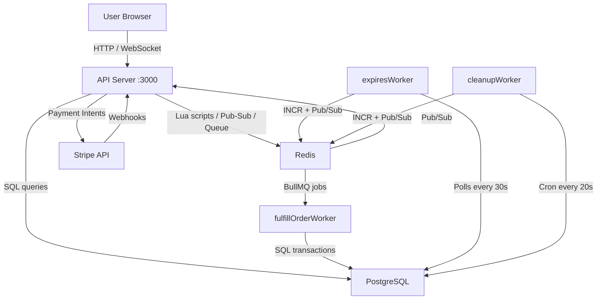
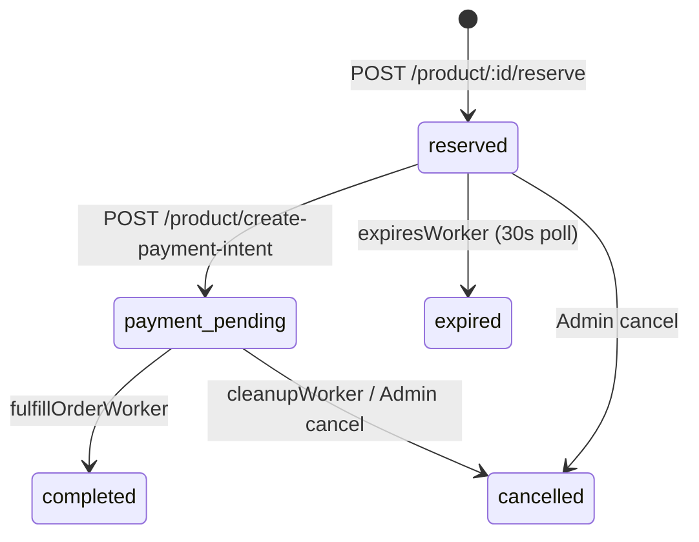

# Product Reservation System — Full Project Documentation

> **Generated**: 2026-05-03 | **Source**: Complete codebase scan of all 28 project files

---

## 1. Project Overview

A **production-grade, fault-tolerant** e-commerce reservation and payment system built with Node.js, PostgreSQL, Redis, and BullMQ. It solves four critical problems:

| Problem | Solution |
|---|---|
| **Race Conditions** | Redis Lua scripts for atomic inventory operations |
| **System Failures** | BullMQ with retry + idempotent workers |
| **Abandoned Carts** | Polling-based expiration worker (30s interval) |
| **Stale UIs** | Socket.IO + Redis Pub/Sub for real-time updates |

### Tech Stack

| Layer | Technology |
|---|---|
| Runtime | Node.js (v20+, ESM modules) |
| HTTP Server | Express.js v5 |
| Database | PostgreSQL (via `pg` Pool) |
| Cache / Queue Broker | Redis (via `ioredis`) |
| Job Queue | BullMQ |
| Payments | Stripe (Payment Intents + Webhooks) |
| Real-Time | Socket.IO + Redis Pub/Sub |
| Templating | EJS |
| Logging | Winston (file + console) |
| Scheduling | node-cron |
| Authentication | JWT in HTTP-only Cookies |

---

## 2. Architecture



### Process Architecture

The system runs as **4 independent Node.js processes**:

| Process | Script | Purpose |
|---|---|---|
| API Server | `npm run dev` | HTTP routes, Socket.IO, webhook receiver |
| Fulfill Worker | `npm run dev:fulfillOrderWorker` | Processes paid orders from BullMQ |
| Expires Worker | `npm run dev:expiresWorker` | Cancels expired reservations (30s poll) |
| Cleanup Worker | `npm run dev:cleanupWorker` | Handles permanently failed jobs (20s cron) |

---

## 3. Directory Structure

```
product_reservation/
├── .env                          # Environment variables (gitignored)
├── .example.env                  # Template for .env
├── .gitignore                    # .env, node_modules, logs, clear.js
├── package.json                  # ESM project, scripts, dependencies
├── decrement_inventory.lua       # Atomic Redis inventory decrement
├── validate_cart.lua             # Atomic cart validation at checkout
├── load-test.yml                 # Artillery load test config
├── test_concurrency.sh           # Bash concurrency test script
├── sql/
│   └── init.sql                  # PostgreSQL schema (products + orders)
└── src/
    ├── server.js                 # Application entry point
    ├── config/
    │   └── loadEnv.js            # dotenv loader (resolves project root)
    ├── db/
    │   ├── connections.js        # PostgreSQL Pool + Redis client exports
    │   └── sync-inventory.js     # Startup inventory sync (PG → Redis)
    ├── middleware/
    │   ├── authenticate.js       # JWT cookie authentication & role guard
    │   ├── rateLimiter.js        # Redis-backed express rate limiters
    │   └── verifyWebhookSignature.js  # Stripe webhook signature verify
    ├── routes/
    │   ├── products.js           # Product CRUD, reservation, checkout, payment
    │   ├── admin.js              # Admin dashboard, retry/cancel failed jobs
    │   ├── auth.route.js         # Unified login/logout & JWT issuing
    │   └── webhook.js            # Stripe webhook endpoint
    ├── service/
    │   └── inventory.service.js  # returnStock() — atomic Redis INCR + Pub/Sub
    ├── queues/
    │   └── purchaseQueue.js      # BullMQ "fulfill-order" queue definition
    ├── sockets/
    │   └── index.js              # Socket.IO init + Redis subscriber bridge
    ├── utils/
    │   ├── logger.js             # Winston logger (console + file transports)
    │   └── redisKeys.js          # Centralized Redis key generators
    ├── workers/
    │   ├── fulfillOrderWorker.js # BullMQ worker — fulfills paid orders
    │   ├── expiresWorker.js      # Polling worker — expires stale reservations
    │   └── cleanupWorker.js      # Cron worker — cancels permanently failed jobs
    ├── views/
    │   ├── product.ejs           # Product detail + real-time inventory
    │   ├── orderPage.ejs         # Checkout / Stripe card payment
    │   ├── dashboard.ejs         # Admin failed-jobs dashboard
    │   └── login.ejs             # Admin login form
    ├── public/
    │   ├── index.html            # (empty)
    │   └── style.css             # Base button/body styles
    └── assets/
        ├── pc.png                # Product image asset
        └── reservation_diagram.drawi.png  # Architecture diagram
```

---

## 4. Database Schema

Source: [init.sql](file:///c:/Users/DELL/Desktop/Product-Reservation/product_reservation/sql/init.sql)

### `products` Table

| Column | Type | Constraints |
|---|---|---|
| `id` | `SERIAL` | PRIMARY KEY |
| `name` | `VARCHAR(255)` | NOT NULL |
| `description` | `TEXT` | — |
| `price` | `NUMERIC(10, 2)` | NOT NULL |
| `inventory` | `INT` | NOT NULL, CHECK ≥ 0 |
| `created_at` | `TIMESTAMPTZ` | DEFAULT CURRENT_TIMESTAMP |

### `orders` Table

| Column | Type | Constraints |
|---|---|---|
| `id` | `SERIAL` | PRIMARY KEY |
| `reservation_id` | `VARCHAR(255)` | UNIQUE, NOT NULL |
| `user_id` | `VARCHAR(255)` | NOT NULL |
| `product_id` | `INTEGER` | NOT NULL |
| `status` | `VARCHAR(50)` | DEFAULT `'reserved'` |
| `stripe_payment_intent_id` | `VARCHAR(255)` | — |
| `amount` | `NUMERIC(10,2)` | NOT NULL |
| `created_at` | `TIMESTAMPTZ` | DEFAULT NOW() |
| `expires_at` | `TIMESTAMPTZ` | — |
| `updated_at` | `TIMESTAMP` | DEFAULT NOW() |

### Order Status State Machine



---

## 5. Redis Data Strategy

Source: [redisKeys.js](file:///c:/Users/DELL/Desktop/Product-Reservation/product_reservation/src/utils/redisKeys.js)

### Key Schema

| Key Pattern | Type | TTL | Purpose |
|---|---|---|---|
| `inventory:product-{id}` | String (integer) | None | Available inventory counter |
| `cart:user-{userId}` | Set | None | User's cart (set of cart entries) |
| `{productId}:rev-{uuid}` | Set member | — | Cart entry format inside cart set |
| `reservation:product:{id}:user-{userId}:rev-{uuid}` | String | 600s | Reservation TTL key |
| `cleanup-lock` | String | 300s | Distributed lock for cleanup worker |

### Redis Pub/Sub

- **Channel**: `inventory-updates`
- **Message format**: `{ "productId": "1", "newInventory": 4 }`
- **Publishers**: `inventory.service.js` (returnStock), `products.js` (reserve)
- **Subscriber**: `sockets/index.js` → bridges to Socket.IO rooms

### Lua Scripts

#### `decrement_inventory.lua` — Atomic Reserve

```
GET key → if stock > 0 → DECR → return new value
         else → return -1 (out of stock)
```

#### `validate_cart.lua` — Atomic Checkout Validation

```
SMEMBERS cartKey → for each item:
  parse productId + reservationId
  EXISTS reservationKey?
    yes → validItems[]
    no  → expiredItems[]
return {validItems, expiredItems}
```

---

## 6. API Reference

### Product Routes (`/product`)

| Method | Path | Auth | Description |
|---|---|---|---|
| `GET` | `/product/:id` | None | Render product page with live inventory from Redis |
| `POST` | `/product/:id/reserve` | JWT Cookie / Bearer | Atomically reserve 1 unit (Lua script) (Rate Limited: 10/15m) |
| `GET` | `/product` | JWT Cookie / Bearer | Render checkout page with cart contents |
| `POST` | `/product/create-payment-intent` | JWT Cookie / Bearer | Validate cart → create Stripe PaymentIntent (Rate Limited: 3/1m) |

### Webhook Routes (`/`)

| Method | Path | Middleware | Description |
|---|---|---|---|
| `POST` | `/webhook-stripe` | `express.raw()` + `verifyStripeWebhook` | Handle Stripe `payment_intent.succeeded` |

### Auth Routes (mounted at `/`)

| Method | Path | Description |
|---|---|---|
| `GET` | `/login` | Render unified login page |
| `POST` | `/login` | Validate credentials, issue JWT in httpOnly cookie |
| `GET` | `/logout` | Clear JWT cookie, redirect |

### Admin Routes (`/admin`) — Requires session auth

| Method | Path | Description |
|---|---|---|
| `GET` | `/admin/dashboard` | Paginated failed jobs list (10/page) |
| `POST` | `/admin/jobs/:jobId/retry` | Retry a failed BullMQ job |
| `POST` | `/admin/jobs/:jobId/cancel` | Cancel order, return stock, remove job |

---

## 7. Core Modules Deep Dive

### 7.1 Server Entry — [server.js](file:///c:/Users/DELL/Desktop/Product-Reservation/product_reservation/src/server.js)

Startup sequence:
1. Load env vars via `loadEnv.js`
2. Create Express app + HTTP server
3. Initialize Socket.IO via `initSockets(httpServer)`
4. Mount webhook route **before** `express.json()` (Stripe needs raw body)
5. Configure cookie-parser middleware
6. Set up EJS view engine
7. Mount auth, product, and admin routes
8. Start Socket.IO server on port 3000
9. Async IIFE: `connectAll()` → `syncInventoryToRedis()` → `app.listen(3000)`

> [!WARNING]
> The server currently calls both `httpServer.listen(3000)` and `app.listen(port)` — this binds port 3000 twice, which may cause an `EADDRINUSE` error.

### 7.2 Database Connections — [connections.js](file:///c:/Users/DELL/Desktop/Product-Reservation/product_reservation/src/db/connections.js)

- **PostgreSQL**: `pg.Pool` with SSL (`rejectUnauthorized: false`)
- **Redis**: `ioredis` with TLS auto-detection based on `rediss://` prefix
- **`connectAll()`**: Idempotent function (uses `isConnected` flag), connects PG pool, waits for Redis ready state
- Exports: `pool`, `redisClient`, `connectAll()`

### 7.3 Inventory Sync — [sync-inventory.js](file:///c:/Users/DELL/Desktop/Product-Reservation/product_reservation/src/db/sync-inventory.js)

Runs at startup to reconcile Redis with PostgreSQL:
```
For each product:
  available = product.inventory
             - COUNT(orders WHERE status='reserved' AND not expired)
             - COUNT(orders WHERE status='payment_pending')
  Redis SET inventory:product-{id} = max(0, available)
```
Uses `redisClient.multi()` for batch atomic writes.

### 7.4 Inventory Service — [inventory.service.js](file:///c:/Users/DELL/Desktop/Product-Reservation/product_reservation/src/service/inventory.service.js)

`returnStock(productId)`:
1. `INCR inventory:product-{productId}` — atomically restore 1 unit
2. `PUBLISH inventory-updates` — trigger real-time UI update
3. Returns the new inventory count

Used by: `expiresWorker`, `cleanupWorker`, `admin.js` (cancel)

### 7.5 Socket.IO — [sockets/index.js](file:///c:/Users/DELL/Desktop/Product-Reservation/product_reservation/src/sockets/index.js)

- **Server**: Creates Socket.IO server, handles `join-product-room` events to place clients into `product-{id}` rooms
- **Redis Subscriber**: Duplicates the Redis client, subscribes to `inventory-updates` channel
- **Bridge**: On `message` event, parses JSON and emits `inventory-update` to the specific product room

### 7.6 Purchase Queue — [purchaseQueue.js](file:///c:/Users/DELL/Desktop/Product-Reservation/product_reservation/src/queues/purchaseQueue.js)

Simple BullMQ `Queue` named `"fulfill-order"` using the shared Redis connection.

---

## 8. Workers

### 8.1 Fulfill Order Worker — [fulfillOrderWorker.js](file:///c:/Users/DELL/Desktop/Product-Reservation/product_reservation/src/workers/fulfillOrderWorker.js)

- **Queue**: `fulfill-order`
- **Trigger**: Stripe webhook adds jobs after `payment_intent.succeeded`
- **Job config**: 3 attempts, 1s fixed backoff, `removeOnComplete: true`, `removeOnFail: false`

**Processing logic**:
1. Validate `job.data.orderId` exists
2. `BEGIN` transaction, `SELECT ... FOR UPDATE` (row lock)
3. **Idempotency check**: if `status === 'completed'` → skip
4. `UPDATE products SET inventory = inventory - 1` (permanent decrement)
5. `UPDATE orders SET status = 'completed'`
6. `COMMIT`
7. On failure: `ROLLBACK` + re-throw for BullMQ retry

### 8.2 Expiration Worker — [expiresWorker.js](file:///c:/Users/DELL/Desktop/Product-Reservation/product_reservation/src/workers/expiresWorker.js)

- **Type**: Polling-based class (`ExpirationCleanup`)
- **Interval**: 30 seconds
- **Concurrency guard**: `this.isRunning` flag

**Processing logic**:
1. `BEGIN` transaction
2. `SELECT * FROM orders WHERE expires_at < NOW() AND status = 'reserved' FOR UPDATE SKIP LOCKED`
3. For each expired order:
   - `UPDATE orders SET status = 'expired'`
   - `returnStock(product_id)` — restores Redis inventory + publishes update
   - `SREM cart:user-{userId}` — removes from user's cart
4. `COMMIT`

### 8.3 Cleanup Worker — [cleanupWorker.js](file:///c:/Users/DELL/Desktop/Product-Reservation/product_reservation/src/workers/cleanupWorker.js)

- **Type**: Cron-based (every 20 seconds via `node-cron`)
- **Distributed lock**: `SET cleanup-lock running NX EX 300` (prevents parallel runs)

**Processing logic**:
1. Acquire Redis lock
2. `purchaseQueue.getFailed()` — get all failed BullMQ jobs
3. For each failed job:
   - `UPDATE orders SET status = 'cancelled'` (if not already completed)
   - `returnStock(product_id)` — restore inventory
   - `job.remove()` — clean from failed queue
4. Release lock

---

## 9. Middleware

### `authenticate.js`
JWT-based guard: checks `req.cookies.token` or `Bearer` header, verifies JWT payload, sets `req.user`, and handles role-based authorization via `requireRole()`.

### `rateLimiter.js`
Provides user identity-based distributed rate limiters using `rate-limit-redis`:
- `reserveLimiter`: Allows 10 requests per 15 minutes.
- `paymentLimiter`: Allows 3 requests per 1 minute.
Includes a JSON error handler and explicitly skips `/health` checks.

### `verifyWebhookSignature.js`
- Initializes Stripe SDK with `STRIPE_SECRET_KEY`
- Verifies `stripe-signature` header using `stripe.webhooks.constructEvent()`
- Attaches verified event to `req.stripeEvent`

> [!NOTE]
> The webhook route is mounted **before** `express.json()` in server.js because Stripe requires the raw request body for signature verification.

---

## 10. Frontend Views (EJS)

| View | Path | Features |
|---|---|---|
| `product.ejs` | `/product/:id` | Real-time inventory via Socket.IO, reserve button, link to checkout |
| `orderPage.ejs` | `/product` | Cart summary with quantities, Stripe Elements card input, PaymentIntent flow |
| `dashboard.ejs` | `/admin/dashboard` | Paginated failed jobs table, retry/cancel buttons per job |
| `login.ejs` | `/login` | Unified username/password form, error display |

### Real-Time Client Flow (product.ejs)
1. Load `socket.io.js` client
2. On `connect` → emit `join-product-room` with product ID
3. Listen for `inventory-update` → update `#inventory` span

### Payment Flow (orderPage.ejs)
1. Load Stripe.js, mount Card Element
2. On click → `POST /product/create-payment-intent`
3. Receive `clientSecret` → `stripe.confirmCardPayment()`
4. Display success/error message

---

## 11. Payment Flow (End-to-End)

```mermaid
sequenceDiagram
    participant U as User
    participant API as API Server
    participant R as Redis
    participant PG as PostgreSQL
    participant S as Stripe
    participant W as fulfillOrderWorker

    U->>API: POST /product/:id/reserve
    API->>R: EVAL decrement_inventory.lua
    R-->>API: newInventory (or -1)
    API->>PG: INSERT INTO orders (status='reserved')
    API->>R: SETEX reservation key (TTL 600s)
    API->>R: SADD cart entry
    API->>R: PUBLISH inventory-updates
    API-->>U: { reservationKey, expiredAt }

    U->>API: POST /product/create-payment-intent
    API->>R: EVAL validate_cart.lua
    API->>PG: UPDATE orders SET status='payment_pending'
    API->>S: stripe.paymentIntents.create()
    S-->>API: { clientSecret }
    API-->>U: { clientSecret }

    U->>S: stripe.confirmCardPayment()
    S->>API: POST /webhook-stripe (payment_intent.succeeded)
    API->>R: purchaseQueue.add("fulfill-order")
    API->>R: DEL reservation keys, SREM cart

    W->>R: Pull job from queue
    W->>PG: BEGIN; SELECT FOR UPDATE; UPDATE products; UPDATE orders status='completed'; COMMIT
```

---

## 12. Configuration

### Environment Variables

Source: [.example.env](file:///c:/Users/DELL/Desktop/Product-Reservation/product_reservation/.example.env)

| Variable | Required | Description |
|---|---|---|
| `DB_HOST` | ✅ | PostgreSQL host |
| `DB_USER` | ✅ | PostgreSQL username |
| `DB_PASSWORD` | ✅ | PostgreSQL password |
| `DB_NAME` | ✅ | PostgreSQL database name |
| `DB_PORT` | ✅ | PostgreSQL port (default: 5432) |
| `REDIS_URL` | ✅ | Redis connection URL |
| `JWT_SECRET` | ✅ | JWT encryption key (must be a non‑empty string, e.g. "super‑secret-key-12345") |
| `ADMIN_USERNAME` | ✅ | Admin dashboard username (default "admin") |
| `ADMIN_PASS` | ✅ | Admin dashboard password (default "password123") |
| `STRIPE_PUBLISHABLE_KEY` | ✅ | Stripe public key (client‑side) |
| `STRIPE_SECRET_KEY` | ✅ | Stripe secret key (server‑side) |
| `STRIPE_WEBHOOK_SECRET` | ✅ | Stripe webhook signing secret |

### NPM Scripts

| Script | Command | Purpose |
|---|---|---|
| `dev` | `cross-env NODE_ENV=development nodemon src/server.js` | Dev server with hot reload |
| `dev:fulfillOrderWorker` | `cross-env NODE_ENV=development node src/workers/fulfillOrderWorker.js` | Dev fulfill worker |
| `dev:expiresWorker` | `cross-env NODE_ENV=development node src/workers/expiresWorker.js` | Dev expiration worker |
| `dev:cleanupWorker` | `cross-env NODE_ENV=development node src/workers/cleanupWorker.js` | Dev cleanup worker |
| `start` | `cross-env NODE_ENV=production node src/server.js` | Production server |
| `start:fulfillOrderWorker` | Production fulfill worker |
| `start:expiresWorker` | Production expiration worker |
| `start:cleanupWorker` | Production cleanup worker |

---

## 13. Logging

Source: [logger.js](file:///c:/Users/DELL/Desktop/Product-Reservation/product_reservation/src/utils/logger.js)

| Level | Priority | Color |
|---|---|---|
| `error` | 0 | Red |
| `warn` | 1 | Yellow |
| `info` | 2 | Green |
| `http` | 3 | Magenta |
| `debug` | 4 | White |

**Transports**:
- In Docker, the `logs/` directory inside the container is mounted to the host via a bind‑mount (`./logs:/app/logs`). This ensures that `error.log` and `combined.log` are persisted on the host and visible in `product_reservation/logs`.
- `logs/error.log` — errors only (JSON format)
- `logs/combined.log` — all levels (JSON format)
- Console — all levels, colorized (development only, suppressed in production)

---

## 14. Graceful Shutdown

To prevent data corruption, orphaned jobs, and open connections, all four Node.js processes handle `SIGTERM` and `SIGINT` signals (e.g. from `docker stop` or `Ctrl+C`).

**Shutdown Sequence:**
1. **Stop Scheduling/Listeners**: `server.js` stops accepting HTTP requests, Socket.IO disconnects clients, and polling/cron jobs stop scheduling new work.
2. **Drain Workers**: BullMQ workers stop accepting new jobs and wait for the currently executing job to resolve or reject (with a 20s timeout). Open Postgres transactions are rolled back.
3. **Close Connections**: BullMQ queues, Postgres pools, and Redis clients are gracefully disconnected.
4. **Timeout Guards**: An overarching 25s timeout ensures the process exits with an error if the shutdown hangs, preventing Docker's 30s `SIGKILL` from killing the process ungracefully.

See `GRACEFUL_SHUTDOWN.md` for full implementation details.

---

## 15. Observability & Health Probes

The API server exposes three endpoints for health checking and observability:
- `GET /health` - Liveness probe (checks process uptime)
- `GET /ready` - Readiness probe (checks PostgreSQL, Redis, BullMQ status)
- `GET /metrics` - Internal observability metrics (requires Admin)

See [HEALTH.md](HEALTH.md) for detailed response schemas and implementation details.

---

## 16. Testing & Load Testing

### Concurrency Test — `test_concurrency.sh`
Simulates 6 concurrent users (`user-A` through `user-F`) all attempting to reserve the same product simultaneously using parallel `curl` calls.

### Artillery Load Test — `load-test.yml`
Fires 20 reservation requests in 1 second against `POST /product/1/reserve`.

```bash
# Run concurrency test
bash test_concurrency.sh

# Run Artillery load test
artillery run load-test.yml
```

---

## 17. Fault Tolerance Patterns

| Pattern | Implementation | Location |
|---|---|---|
| **Atomic operations** | Redis Lua scripts | `decrement_inventory.lua`, `validate_cart.lua` |
| **Distributed rate limiting**| `express-rate-limit` + Redis store | `rateLimiter.js` |
| **Idempotent processing** | Status check before fulfillment | `fulfillOrderWorker.js` L37 |
| **Row-level locking** | `SELECT ... FOR UPDATE` | `fulfillOrderWorker.js`, `admin.js` |
| **Skip locked rows** | `FOR UPDATE SKIP LOCKED` | `expiresWorker.js` L23 |
| **Compensation logic** | Revert to `reserved` on payment failure | `products.js` L275-311 |
| **Distributed locking** | Redis `SET NX EX` | `cleanupWorker.js` L13 |
| **Automatic retry** | BullMQ 3 attempts, 1s backoff | `webhook.js` L29-33 |
| **Graceful degradation** | Sync failure doesn't block startup | `server.js` L68-70 |

---

## 18. Known Issues & Observations

> [!NOTE]
> **Mock User DB**: The application currently uses a `MOCK_USERS` object in `auth.route.js`. This should be replaced with a real database user lookup table.

---

## 19. Dependency Summary

### Production Dependencies

| Package | Version | Purpose |
|---|---|---|
| `bullmq` | ^5.56.10 | Reliable job queue on Redis |
| `dotenv` | ^17.2.0 | Environment variable loading |
| `ejs` | ^3.1.10 | Server-side HTML templating |
| `express` | ^5.1.0 | HTTP framework |
| `express-rate-limit`| ^7.5.0 | Rate limiting middleware |
| `cookie-parser` | ^1.4.6 | Cookie parsing middleware |
| `jsonwebtoken` | ^9.0.2 | JWT signing and verification |
| `ioredis` | ^5.7.0 | Redis client |
| `rate-limit-redis`| ^4.2.0 | Redis store for rate limiting |
| `node-cron` | ^4.2.1 | Cron scheduling |
| `pg` | ^8.16.3 | PostgreSQL client |
| `pool` | ^0.4.1 | Generic pooling (unused—`pg` has built-in Pool) |
| `socket.io` | ^4.8.1 | WebSocket server |
| `stripe` | ^18.5.0 | Payment processing SDK |
| `uuid` | ^11.1.0 | UUID generation for reservations |
| `winston` | ^3.17.0 | Structured logging |

### Dev Dependencies

| Package | Version | Purpose |
|---|---|---|
| `cross-env` | ^10.0.0 | Cross-platform env variable setting |
| `node-fetch` | ^3.3.2 | HTTP client for testing |
| `nodemon` | ^3.1.10 | Auto-restart on file changes |
