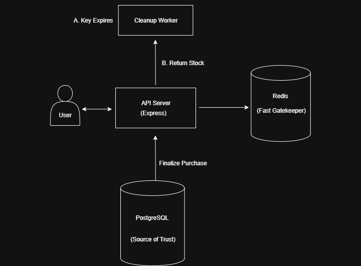

# High-Concurrency Inventory Reservation System

A production grade system built with Node.js, PostgreSQL, and Redis to solve the "race condition" problem found in high-traffic e-commerce and booking platforms. This project demonstrates how to prevent overselling of limited-stock items during a flash sale, ensuring data consistency and a reliable user experience.



---

## The Problem: Race Conditions & Abandoned Carts

In any system with limited resources (like concert tickets, flash sale items, or hotel rooms), a naive inventory management system will fail under concurrent load. Two critical problems arise:

1.  **Race Conditions:** When multiple users try to buy the last available item at the same millisecond, a simple `read-then-write` database operation can allow both purchases to succeed, leading to overselling, operational failures, and angry customers.
2.  **Abandoned Carts:** If a user reserves an item but never completes the purchase, that stock is held indefinitely, preventing other paying customers from buying it.

## The Solution: An Atomic & Time-Bound Reservation System

This system prevents these issues by using Redis as a high-speed gatekeeper for inventory management and implementing a complete reservation lifecycle.

- **Polyglot Persistence:** Uses **PostgreSQL** as the permanent, relational source of truth for inventory and **Redis** for high-speed, volatile reservation handling.
- **Atomic Reservations:** All reservation requests are handled by a **Redis Lua script**. This script runs atomically, ensuring that the process of checking stock and decrementing it is an indivisible operation that cannot be interrupted, completely eliminating the race condition.
- **Time-Bound Holds (TTL):** When a reservation is made, a temporary, user-specific key is created in Redis with a 10-minute **Time-To-Live (TTL)**. If the user doesn't complete the purchase within this window, the hold automatically expires.
- **Background Cleanup Worker:** A separate Node.js process listens for Redis Keyspace Notifications. When a reservation key expires, this worker automatically and atomically returns the stock to the main inventory count, making it available for others.

---

## ✨ Key Features

- **Race Condition Proof:** Guarantees data consistency with thousands of concurrent requests.
- **High Performance:** Offloads high-traffic reservation logic to in-memory Redis, protecting the primary database.
- **Full Reservation Lifecycle:** Manages temporary holds and automatically handles abandoned carts using Redis TTLs and a background worker.
- **Atomic State Management:** Uses Redis Lua scripting for uninterruptible conditional operations.
- **Polyglot Architecture:** Demonstrates the professional pattern of using the right tool for the right job.

---

## 🛠️ Tech Stack

- **Backend:** Node.js, Express.js
- **Primary Database:** PostgreSQL
- **In-Memory Store:** Redis (for caching, atomic operations, and pub/sub)
- **Load Testing:** Artillery.io

---

## 🚀 Getting Started

### Prerequisites

- Node.js (v18+)
- PostgreSQL
- Redis
- Artillery (`npm install -g artillery`)

### Setup & Installation

1.  **Clone the repository:**

    ```bash
    git clone [https://github.com/](https://github.com/)[TheBigWealth89]/[product_reservation].git
    cd [product_reservation]
    ```

2.  **Install dependencies:**

    ```bash
    npm install
    ```

3.  **Configure Redis:**

    - Enable Keyspace Notifications to allow the cleanup worker to function. Run this command using `redis-cli`:
      ```
      redis-cli config set notify-keyspace-events Ex
      ```

4.  **Set up the database:**

    - Create a PostgreSQL database.
    - Run the schema script in `database.sql` to create the `products` table.
    - Set your database credentials in a `.env` file.

5.  **Run the application:**
    - Open two separate terminals.
    - **Terminal 1 (Main Server):** `npm start`
    - **Terminal 2 (Cleanup Worker):** `node src/cleanup-worker.js`
