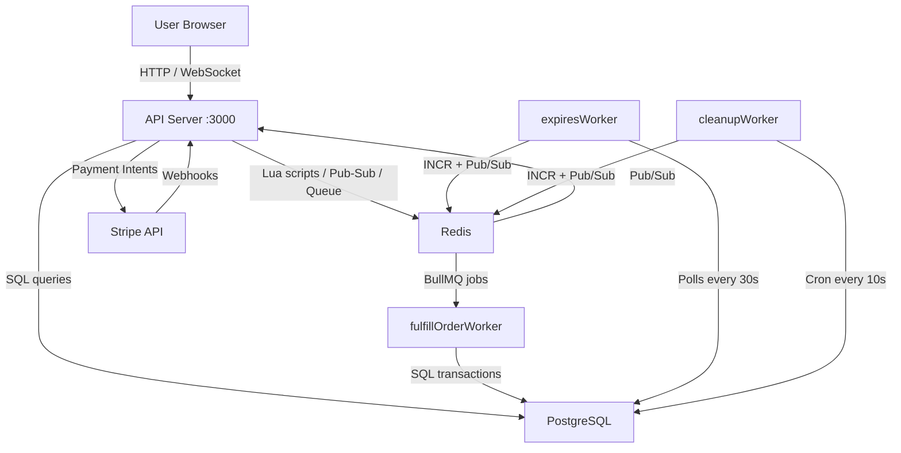

# Product Reservation System

A production-grade, fault-tolerant e-commerce reservation and payment system built with Node.js, PostgreSQL, Redis, and BullMQ. It solves the four hardest problems in high-concurrency commerce: race conditions on shared inventory, lost orders during system failures, abandoned cart stock leakage, and stale user interfaces showing wrong inventory counts — all in a single, deployable multi-process Node.js application.

---

## Tech Stack

| Layer | Technology |
|---|---|
| Runtime | Node.js (v20+, ESM modules) |
| HTTP Server | Express.js v5 |
| Database | PostgreSQL (via `pg` Pool) |
| Cache / Queue Broker | Redis (via `ioredis`) |
| Job Queue | BullMQ |
| Payments | Stripe (Payment Intents + Webhooks) |
| Real-Time | Socket.IO + Redis Pub/Sub |
| Templating | EJS |
| Logging | Winston (file + console transports) |
| Scheduling | node-cron |
| Authentication | JWT in HTTP-only cookies |
| Development | Docker Compose Watch + Node.js `--watch` |

---

## Architecture Diagram



---

## Quick Start

```bash
# 1. Clone the repository
git clone https://github.com/TheBigWealth89/product_reservation.git
cd product_reservation

# 2. Copy the environment template and fill in your values
cp .example.env .env

# 3. Start the fully local stack (PostgreSQL + Redis + all services)
docker compose -f docker-compose.local.yml up --watch
```

The API is available at `http://localhost:3000`. See [development/setup.md](development/setup.md) for manual setup and all environment variable descriptions.

---

## Documentation Index

| File | Description |
|---|---|
| [architecture/overview.md](architecture/overview.md) | System design, 4-process model, directory structure, tech stack rationale |
| [architecture/data-flow.md](architecture/data-flow.md) | Payment flow, reservation flow, Redis Pub/Sub bridge, webhook flow |
| [architecture/fault-tolerance.md](architecture/fault-tolerance.md) | Every defensive pattern — what it protects, where it lives, why it was chosen |
| [api/endpoints.md](api/endpoints.md) | Complete API reference: all routes, auth, rate limits, request/response shapes |
| [api/websockets.md](api/websockets.md) | Socket.IO events, Redis Pub/Sub channel, real-time bridge explained |
| [database/schema.md](database/schema.md) | PostgreSQL tables: all columns, types, constraints |
| [database/redis.md](database/redis.md) | Redis key schema, TTLs, Lua scripts, Pub/Sub channel |
| [database/state-machine.md](database/state-machine.md) | Order status lifecycle: valid transitions, invalid transitions, inventory impact |
| [development/setup.md](development/setup.md) | Prerequisites, local setup steps, env vars, npm scripts, common errors |
| [development/docker.md](development/docker.md) | All three Compose files explained — when to use each, what each starts |
| [development/workers.md](development/workers.md) | Worker architecture, each worker explained, processor extraction |
| [operations/health.md](operations/health.md) | `/health`, `/ready`, `/metrics` endpoints — shapes, latency, interpretation |
| [operations/logging.md](operations/logging.md) | Winston config, log levels, transports, log file locations |
| [operations/shutdown.md](operations/shutdown.md) | Graceful shutdown — full implementation detail, timeout ladder, per-process sequences |
| [testing/strategy.md](testing/strategy.md) | Testing philosophy, Vitest rationale, layers, infrastructure, test isolation |
| [testing/test-cases.md](testing/test-cases.md) | All critical paths A–I with every test case in structured format |
| [testing/running-tests.md](testing/running-tests.md) | How to run tests, all npm test scripts, priority ranking, CI integration |

---

## Known Limitations

> **Mock User Database**: `src/routes/auth.route.js` uses a hardcoded `MOCK_USERS` object for authentication. In production this must be replaced with a real database user table and a proper credential-hashing flow (e.g. bcrypt + a `users` table in PostgreSQL).

> **Unused `pool` package**: The `pool` package (`^0.4.1`) appears in the dependency tree but serves no purpose — `pg` ships its own `Pool` class that is already in use throughout the codebase. The `pool` package can be safely removed with `npm uninstall pool`.
