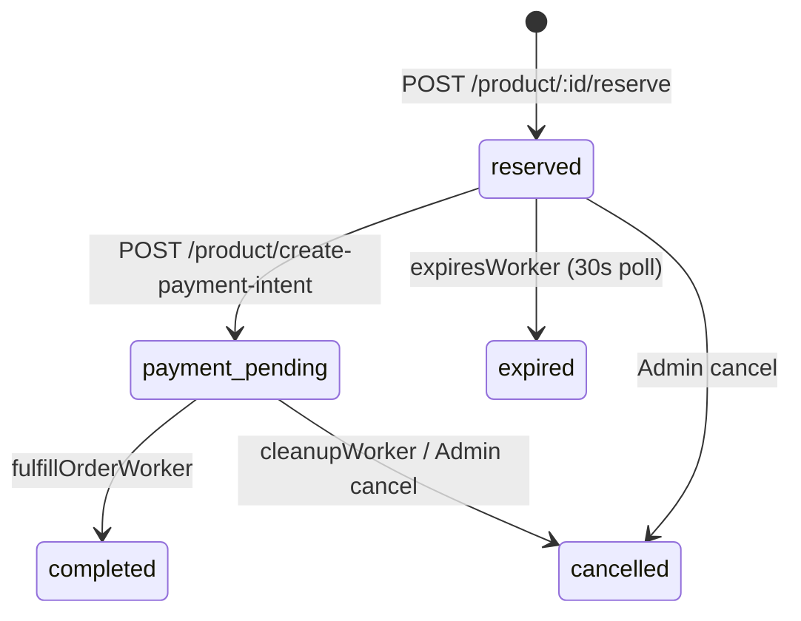

# Order State Machine

This document defines the complete order lifecycle: every valid transition, every invalid transition, and what each status means for inventory in both Redis and PostgreSQL.

For the schema definition of the `status` column, see [schema.md](schema.md).

---

## State Diagram



---

## Valid Transitions

| From | To | Trigger | Process | Notes |
|---|---|---|---|---|
| *(new)* | `reserved` | `POST /product/:id/reserve` | API Server | Lua script decrements Redis; DB row inserted |
| `reserved` | `payment_pending` | `POST /product/create-payment-intent` | API Server | Stripe PaymentIntent created; reservation TTL still active |
| `payment_pending` | `completed` | Stripe `payment_intent.succeeded` webhook → BullMQ | fulfillOrderWorker | Permanent PostgreSQL inventory decrement; Redis already decremented at reserve time |
| `reserved` | `expired` | Poll finds `expires_at < NOW()` | expiresWorker | Redis inventory restored; cart entry removed |
| `payment_pending` | `cancelled` | Permanently failed BullMQ job | cleanupWorker | Redis inventory restored; job removed from failed queue |
| `reserved` | `cancelled` | Admin clicks cancel | API Server (admin route) | Redis inventory restored via `returnStock()` |
| `payment_pending` | `cancelled` | Admin clicks cancel | API Server (admin route) | Redis inventory restored via `returnStock()` |

---

## Invalid Transitions

The following transitions are not implemented and must not occur.

| From | To | Why It Cannot Happen |
|---|---|---|
| `completed` | any other status | A completed order represents a confirmed, charged payment. Reversing it would require a Stripe refund — a separate business process entirely outside this state machine. |
| `expired` | any other status | An expired reservation has already had its Redis inventory restored. Re-activating it would double-count that inventory. |
| `cancelled` | any other status | Cancelled orders are terminal. The stock has been returned and the BullMQ job removed. There is nothing to re-activate. |
| `reserved` | `completed` | Completion requires a confirmed Stripe payment and a BullMQ job. Direct transition skips both and would leave a payment debt with no Stripe record. |
| `payment_pending` | `reserved` | This transition is only made by the compensation logic in `products.js` when Stripe PaymentIntent *creation* fails — not after it succeeds. Once a PaymentIntent exists in Stripe, the order must either complete or be cancelled; it cannot go back to reserved. |
| `payment_pending` | `expired` | The `expiresWorker` intentionally ignores rows with `status = 'payment_pending'`. Expiring an order mid-payment would return stock and invalidate a live Stripe charge. |

---

## Per-Status Inventory Impact

Each status has a defined meaning for inventory across both Redis and PostgreSQL.

| Status | Redis `inventory:product-{id}` | PostgreSQL `products.inventory` | Explanation |
|---|---|---|---|
| `reserved` | **Decremented** | Unchanged | The Redis counter is the live fast-path. PostgreSQL has not yet been permanently updated. |
| `payment_pending` | Decremented (already decremented at `reserved` time) | Unchanged | No additional change. The PaymentIntent is live with Stripe. |
| `completed` | Already decremented | **Decremented** | `fulfillOrderWorker` permanently decrements the PostgreSQL count. This is the only time PostgreSQL inventory changes. |
| `expired` | **Restored** (+1 via `returnStock()`) | Unchanged | `expiresWorker` calls `returnStock()` which `INCR`s Redis and publishes an update. PostgreSQL inventory was never decremented for this order. |
| `cancelled` | **Restored** (+1 via `returnStock()`) | Unchanged | Same as expired — `cleanupWorker` or admin cancel calls `returnStock()`. PostgreSQL inventory was never decremented. |

### Reconciliation

At startup, `sync-inventory.js` reconciles Redis with PostgreSQL using this formula:

```
available = product.inventory
           - COUNT(orders WHERE status='reserved'  AND not expired)
           - COUNT(orders WHERE status='payment_pending')
SET inventory:product-{id} = MAX(0, available)
```

This ensures that if the API server is restarted after a crash (which may have left orphaned Redis state), the inventory counter is reset to the correct value derived from the permanent PostgreSQL source of truth.
